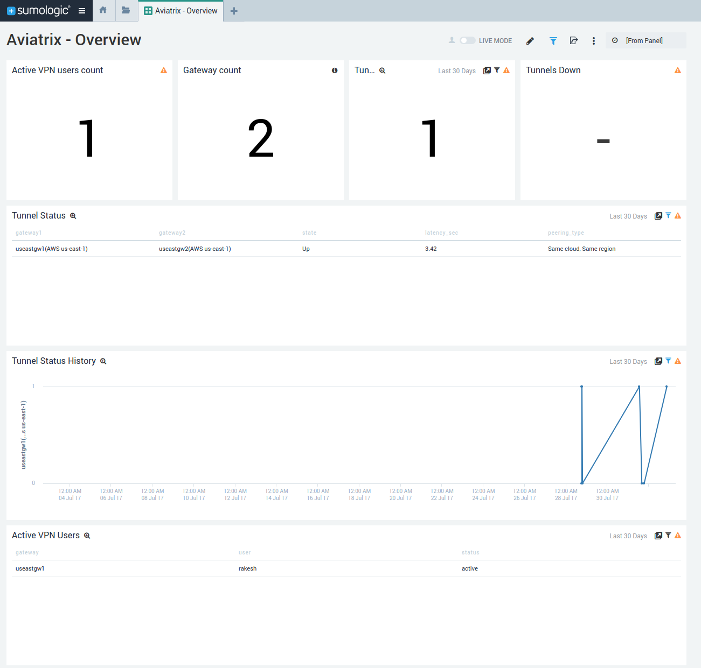
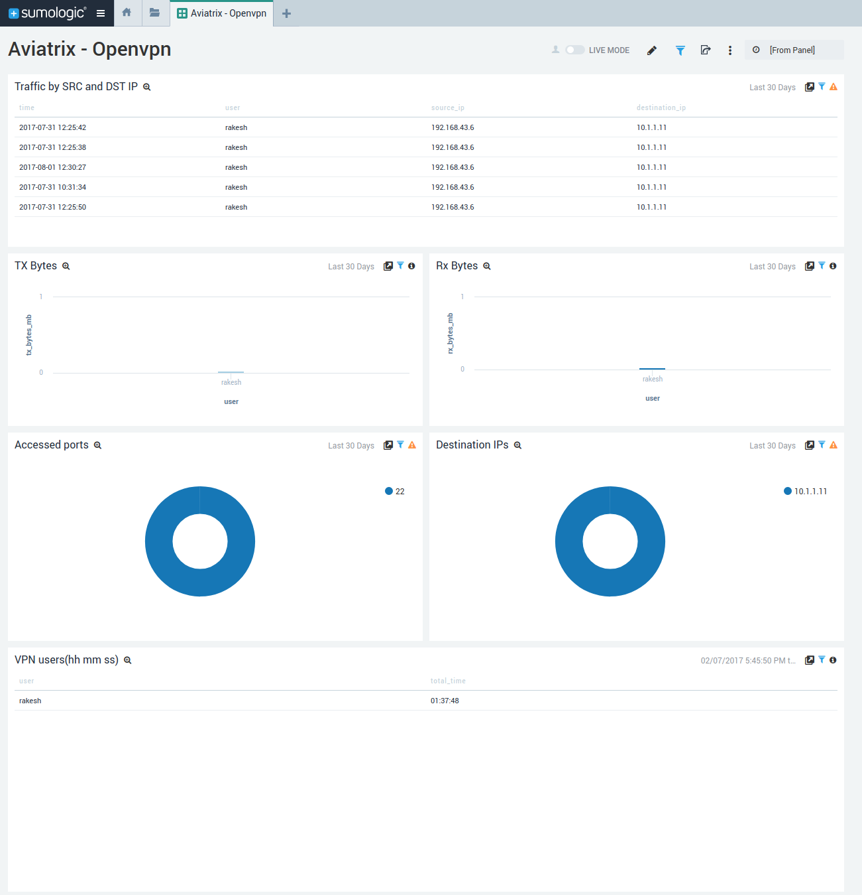

# Sumo Logic App for Aviatrix
Copyright &copy; 2014-2017 Aviatrix Systems, Inc. All rights reserved.

* **Authors:** Rakesh Ranjan

## Description
Aviatrix Systems provides the next generation cloud networking solution built from the ground up for the public cloud.

The Sumo Logic App for Aviatrix provides insights into Aviatrix hybrid cloud networking solution. This app uses predefined searches and Dashboards to provide real time monitoring capabilities into your environment.

## Install App
### Step1: Download JSON 
This app is avialable as JSON file which can be imported as private content in your Sumologic Library.  
Save Aviatrix.json file on your local system.

### Step2: Import App in the Library
To import App in your Sumo Logic instance:
1. Go to library, and in your Personal folder, click the Import button.
2. In the Content Import dialog, enter Name as Aviatrix.
3. In JSON section, paste the JSON content from Aviatrix.json file downloaded in Step1.
4. Click Import.
5. Aviatrix app will now be listed in the Personal folder.

## Setup
Make sure the latest version of Aviatrix software is installed before you start to configure the controller. You should see the alert for software upgrade on the menu bar of the controller if a newer version is available.  
Click Upgrade and wait for the upgrade to complete.

Follow the steps below to enable the logging for Sumo Logic.

1. Launch the web browser and input the URL of your controller.
2. Once logged in, navigate to Settings > Loggings.
3. Enable the logging for Sumo Logic by clicking the status button area. A new panel will appear for you to input Access ID and Access Key. Click Enable when you are done.
4. To enable AviatrixRule logging, select packet logging when configuring gateway security policies. This is done by clicking the gateway of interests at Gateway panel.
5. To verify if the logs are delivered to the specified Sumo Logic servers, make a user VPN connection through any gateway managed by the controller. At the prompt on Search bar of Sumo Logic, type Aviatrix* and you shall see the Aviatrix logs.

## Sample dashboards

### Aviatrix - Overview

### Aviatrix - Gateway

### Aviatrix - VPN

### Aviatrix - Security

## Support
Found a bug or need a feature?
  [Open an issue on github](https://github.com/AviatrixSystems/SumologicforAviatrix/issues)
